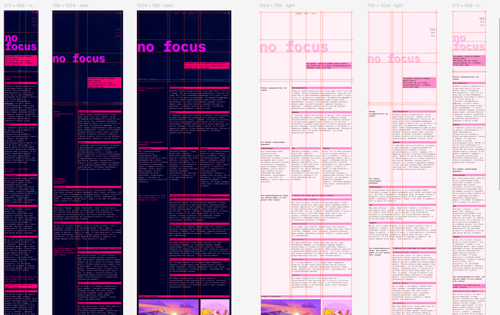

<h1 align="center">Hi there, I'm <a href="https://github.com/eeugene152/" target="_blank">Eugene Emelkhovsky</a> 
</h1>
<h3 align="center">Front learner from Russia 🇷🇺</h3>

# Проект «Сложно сосредоточиться» — описание:
«Сложно сосредоточиться» — проект, исследующий проблему дефицита внимания в цифровую эпоху. Проект выполнен в эстетике интерфейсов систем наблюдения и старых консолей.
## Адрес на GIT
### https://github.com/eeugene152/slozhno-sosredotochitsya-fd

Мой третий проект в рамках обучения веб-разработке. это адаптивный многостраничный лендинг, сверстанный по макету из *Figma* с акцентом на точность реализации (*Pixel Perfect*) и использование современных инструментов CSS.

## 🎯 Цели проекта
- **Реализовать верстку** сложного интерфейса строго по макету из Figma.
- **Обеспечить "резиновость" дизайна** при изменении разрешения экрана.
- **Добиться максимального совпадения с дизайном** (использование техники *Pixel Perfect*).

## 🛠 Технологии и инструменты
- **HTML5 & CSS3** (Custom Properties, Grid Layout, Flexbox).
- **Методология БЭМ** (BEM Core) — для создания независимых, масштабируемых компонентов.

## 🏗 Семантика и структура (Semantic HTML)
- **Осмысленная разметка**: использование тегов `<section>`, `<article>`, `<header>`, `<footer>` и `<nav>` вместо бесконечных div. Это делает структуру кода понятной и логичной.
- **Иерархия заголовков**: строгое соблюдение вложенности `h1–h2`, что важно для правильного построения дерева документа.

## 🧱 Продвинутые сетки (Grid & Flexbox)
- **Кастомные Grid-раскладки**: использование нестандартных пропорций (например, `1fr 2fr`), что позволило точно передать асимметричный дизайн макета без лишних оберток в HTML.
- **Контейнерные запросы** (`@container`): галерея изображений и карточки адаптируются не к размеру экрана, а к размеру своего родительского блока, что делает компоненты по-настоящему независимыми.

## 🌓 Работа с темами и цветом
- **Автоматическая смена тем**: реализована через медиазапрос `prefers-color-scheme`, который подстраивает проект под системные настройки пользователя.
- **Умные CSS-переменные**: вся цветовая схема вынесена в переменные. Использование функций `calc()` и единиц измерения окна просмотра (`vh`) позволило создать гибкую систему отступов и размеров.

## 📱 Современная адаптивность
- **Mobile First & Breakpoints**: верстка разработана по принципу «от меньшего к большему», что гарантирует стабильность на смартфонах.
- **Новый синтаксис диапазонов**: использование современного написания медиазапросов (например, `@media (width < 768px)`), что делает код чище и понятнее.
- **Fluid Typography**: использование функции `clamp()` для создания «резиновых» заголовков, которые плавно масштабируются без резких скачков.

## 🚀 Особенности реализации
- **Pixel Perfect Workflow**: работа с макетами высокой сложности, соблюдая микро-типографику и сетку с точностью до пикселя.
- **«Продвинутые сетки»** -  кастомизация стандартных сеток под нужды дизайна.
- **Проектировать гибкую архитектуру стилей**, где смена темы происходит за счет переопределения переменных в одном месте.
- **Архитектура CSS**: организация глобальных переменных так, чтобы изменение одного значения (например, основного акцентного цвета) мгновенно обновляло весь проект.

## 📈 Чему я научился:
- **Работать с макетами** высокой сложности, соблюдая микро-типографику и сетку с точностью до пикселя (_Pixel Perfect_).
- **Управлять состояниями** элементов через :hover, :active и :focus-visible, создавая живой и отзывчивый интерфейс.
- **Использовать современные возможности CSS** (переменные, функции, сложные гриды) для создания чистого и поддерживаемого кода.

## 🛠 Рефакторинг и оптимизация (после ревью)
### Проект прошел этап переработки кода для соответствия современным стандартам верстки.
- **Семантика и структура**: 
  - Переработал список статей — теперь однотипные сущности реализованы через список `<ul>` / `<li>`, что улучшило иерархию и доступность. 
  - Исправил уровни заголовков `<h3>` в соответствии с логикой документа.
  - Исправил критичную ошибку, когда `<h3>` был прямым потомком списка `<ul>`.
- **Типографика и стили**: 
  - Настроил безопасный стек шрифтов: добавил альтернативные варианты (_fallback_) в свойство `font-family`.
  - Перевел трансформацию текста в верхний регистр на CSS (`text-transform`), избавившись от капса в HTML.
  - Стилизовал пропущенные ссылки в статьях.
  - Добавил (возможные) отступы между параграфами, чтобы текст не «слипался» при изменении контента.
  - Синхронизировал визуальные эффекты (тени) заголовков в хедере и футере.
  - Исправил найденные несоответствия цветов (в сравнении с макетом) - обводка ссылок, цвет заголовков. Чтобы унифицировать цвет обводки ссылок (по макету цвет обводки = цвету текста в теме), использовано свойство `currentColor`
- **Гибкость верстки**:
  - Убрал жесткие ограничения высоты блоков. Теперь контейнеры адаптивны и подстраиваются под объем содержимого.
  - Для кнопок заменил фиксированную высоту на `min-height` для лучшего отображения текста при масштабировании.
- **User Experience и именование**:
  - Добавил `cursor: pointer` для всех интерактивных элементов (кнопок), улучшив визуальный отклик.
  - Провел рефакторинг классов: убрал привязку имен к конкретному тексту или четности элементов (убрал `-even`, `-not-even`). Теперь стили более универсальны и не ломаются при изменении порядка секций.

### [Посмотреть проект на GitHub](https://github.com/eeugene152/slozhno-sosredotochitsya-fd)
# Авторство:
- Яндекс Практикум (https://practicum.yandex.ru/)
- GitHub: [@eeugene152](https://github.com/eeugene152/)
- Telegram: [@eemelkhovsky](https://t.me/eemelkhovsky/)

-----
*Проект выполнен в учебных целях.*
